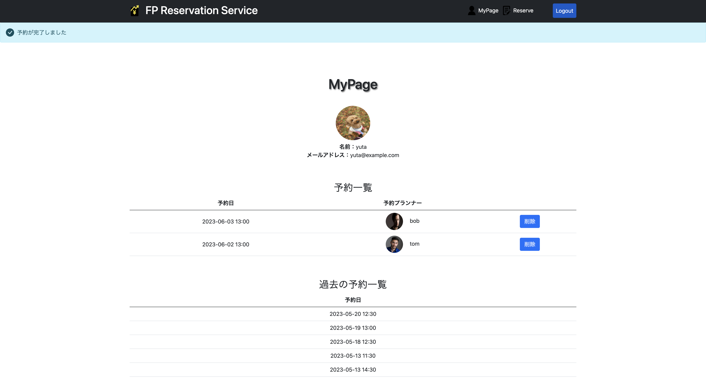

# Financial Planner Service

## demonstration

ホーム画面

フォーム画面

クライアント画面

プランナー画面

## ダウンロード
git clone 

もしくは、zip ファイルでダウンロードしてください。

## 環境構築手順
環境を構築したいディレクトリで `git clone` を行い、フォルダを作成する。
docker compose.yml ファイルがあるディレクトリで以下のコマンドを順に打つ

1. `docker-compose up -d` コマンドでコンテナを作成
2. `docker-compose run web rails db:create` コマンドでデータベースを作成
3. `docker-compose run web bundle exec rails ridgepole:apply` コマンドでデータベースにテーブル作成
4. localhost:3000にアクセス
